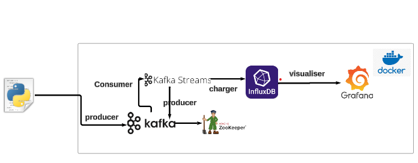
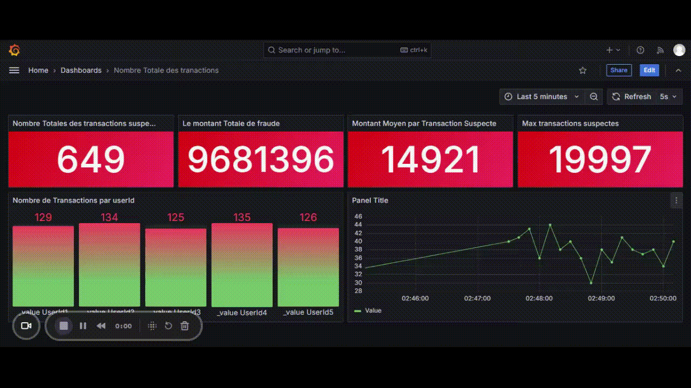

# Système de Détection de Fraudes Financières en Temps Réel

## Description du Projet

Ce projet implémente un système complet de détection de fraudes financières utilisant les technologies suivantes :
- Kafka Streams pour le traitement des flux de transactions
- InfluxDB pour le stockage des données
- Grafana pour la visualisation en temps réel

## Project Architecture



## Prérequis

- Docker
- Docker Compose
- Java 11+ (pour l'application Kafka Streams)

## Configuration

### Identifiants InfluxDB
- Nom d'utilisateur : `mohamedamine`
- Mot de passe : `reda12..`

## Architecture du Système

1. **Kafka** : Gère les flux de transactions
   - Topic d'entrée : `transactions-input`
   - Topic des alertes : `fraud-alerts`

2. **InfluxDB** : Stockage des transactions suspectes

3. **Grafana** : Tableau de bord de visualisation

## Déploiement

### Étapes de Déploiement

1. Cloner le dépôt
```bash
git clone https://github.com/AMINESDQ/RealTimeFraudDetection
cd projet-detection-fraudes
```

2. Construire l'image de l'application
```bash
docker build -t detectionapp:latest ./app
```

3. Démarrer l'environnement
```bash
docker-compose up -d
```

## Accès aux Services

- **Grafana** : http://localhost:3000
- **InfluxDB** : http://localhost:8086
- **Kafka** : localhost:9092

## Règles de Détection de Fraudes

Détection des transactions suspectes basée sur les critères suivants :
- Montant de transaction supérieur à 10 000

## Testing and Validation

1. **Simulate Transactions**:
   Produce sample JSON transactions to the `transactions-input` topic:
   ```bash
   kafka-console-producer --topic transactions-input --bootstrap-server localhost:9092
   > {"userId": "12345", "amount": 15000, "timestamp": "2024-12-04T15:00:00Z"}
   > {"userId": "67890", "amount": 5000, "timestamp": "2024-12-04T15:05:00Z"}
   ```

   Alternatively, you can use the following Python script:

   **`producer.py`:**
   ```python
   from confluent_kafka import Producer
   import json
   import time
   import random

   # Configuration de Kafka
   BOOTSTRAP_SERVERS = 'localhost:9092'
   TOPIC_INPUT = 'transactions-input'

   # Configuration pour 2000 transactions en 120 secondes
   TOTAL_TRANSACTIONS = 5000
   DURATION_SECONDS = 300
   INTERVAL = DURATION_SECONDS / TOTAL_TRANSACTIONS  # Intervalle entre les envois

   # Fonction pour produire des transactions
   def delivery_report(err, msg):
       """
       Callback pour signaler le succès ou l'échec de la livraison d'un message.
       """
       if err is not None:
           print(f"Échec de l'envoi du message : {err}")
       else:
           print(f"Message envoyé avec succès au topic {msg.topic()} [partition {msg.partition()}]")

   def produce_transactions():
       # Configuration du Producer Kafka
       producer_config = {
           'bootstrap.servers': BOOTSTRAP_SERVERS,
           'linger.ms': 10,  # Réduire la latence d'envoi
       }
       producer = Producer(producer_config)

       print(f"Envoi de {TOTAL_TRANSACTIONS} transactions au topic '{TOPIC_INPUT}' en {DURATION_SECONDS} secondes...")

       user_ids = ['11111', '22222', '33333', '44444', '55555']
       for i in range(TOTAL_TRANSACTIONS):
           user_id = random.choice(user_ids)
           amount = random.randint(1000, 20000)  # Montant entre 1000 et 20000
           timestamp = time.strftime('%Y-%m-%dT%H:%M:%SZ', time.gmtime())
           transaction = {
               "userId": user_id,
               "amount": amount,
               "timestamp": timestamp
           }

           # Envoi au topic Kafka
           try:
               producer.produce(
                   topic=TOPIC_INPUT,
                   key=str(user_id),
                   value=json.dumps(transaction),
                   callback=delivery_report
               )
           except Exception as e:
               print(f"Erreur lors de l'envoi : {e}")

           # Pause pour respecter l'intervalle
           time.sleep(INTERVAL)

       # Assurez-vous que tous les messages ont été transmis avant de fermer
       producer.flush()

       print("Toutes les transactions ont été envoyées avec succès.")

   if __name__ == '__main__':
       produce_transactions()
   ```

## Monitoring

Le tableau de bord Grafana affiche en temps réel :
- Nombre de transactions suspectes par utilisateur
- Montant total des transactions suspectes
   

  

## Arrêter l'Environnement

```bash
docker-compose down
```

## Dépannage

- Vérifiez les logs des conteneurs : 
```bash
docker-compose logs <nom-du-service>
```

Requêtes InfluxDB pour l'Analyse des Transactions Suspectes
1. Montant Maximum d'une Transaction Suspecte
fluxCopyfrom(bucket: "aminesdq")
  |> range(start: v.timeRangeStart, stop: v.timeRangeStop)
  |> filter(fn: (r) => r["_measurement"] == "suspicious_transactions")
  |> filter(fn: (r) => r["_field"] == "amount")
  |> group(columns: [])
  |> max()
  |> yield(name: "max_transaction_amount")
2. Nombre Total de Transactions Suspectes
fluxCopyfrom(bucket: "aminesdq")
  |> range(start: v.timeRangeStart, stop: v.timeRangeStop)
  |> filter(fn: (r) => r["_measurement"] == "suspicious_transactions")
  |> filter(fn: (r) => r["_field"] == "amount")
  |> group(columns: [])
  |> count()
  |> yield(name: "transaction_count")
3. Montant Moyen d'une Transaction Suspecte
```fluxCopyfrom(bucket: "aminesdq")
  |> range(start: v.timeRangeStart, stop: v.timeRangeStop)
  |> filter(fn: (r) => r["_measurement"] == "suspicious_transactions")
  |> filter(fn: (r) => r["_field"] == "amount")
  |> group(columns: [])
  |> mean()
  |> yield(name: "average_transaction_amount")```
4. Montant Total des Transactions Suspectes
```fluxCopyfrom(bucket: "aminesdq")
  |> range(start: v.timeRangeStart, stop: v.timeRangeStop)
  |> filter(fn: (r) => r["_measurement"] == "suspicious_transactions")
  |> filter(fn: (r) => r["_field"] == "amount")
  |> group(columns: [])
  |> sum()
  |> yield(name: "total_transaction_amount")```
5. Nombre de Transactions Suspectes par Utilisateur
```fluxCopyfrom(bucket: "aminesdq")
  |> range(start: v.timeRangeStart, stop: v.timeRangeStop)
  |> filter(fn: (r) => r["_measurement"] == "suspicious_transactions")
  |> filter(fn: (r) => r["_field"] == "amount")
  |> group(columns: ["userId"])
  |> count()
  |> keep(columns: ["userId", "_value"])```
6. Somme des Transactions Suspectes par Intervalle de 30 Secondes
```fluxCopyfrom(bucket: "aminesdq")
  |> range(start: v.timeRangeStart, stop: v.timeRangeStop)
  |> filter(fn: (r) => r["_measurement"] == "suspicious_transactions")
  |> filter(fn: (r) => r["_field"] == "amount")
  |> group(columns: [])
  |> aggregateWindow(every: 30s, fn: sum, createEmpty: false)
  |> yield(name: "transaction_sum_per_30s")```

**Note :** Assurez-vous d'avoir Docker et Docker Compose installés avant de démarrer le projet.


